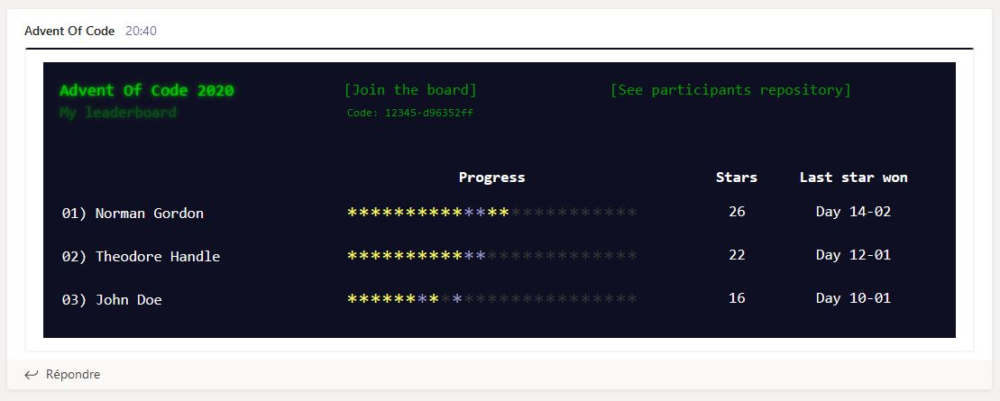

# Advent Of Code - Microsoft Teams Leaderboard

Allow you to sent an Advent of Code (AoC) private leaderboard in a Microsoft Teams room via a Webhook connector.




## Installation

Clone this repository, install node modules using `npm install` then create a `.env` file at the root level with the following content:

````
# Mandatory: You leaderboard ID
# (available in the URL https://adventofcode.com/{year}/leaderboard/private/view/{leaderboard-id)
AOC_LEADERBOARD_ID=

# Mandatory: Your session cookie (with access to the private leaderboard)
# Required format: AOC_COOKIE=session=XXXXXXXXXXXXXXXXXXXXXXXXXXXXXXX
AOC_COOKIE=

# Optional: The webhook URL used to the sent the leaderboard 
# (see: https://docs.microsoft.com/en-us/microsoftteams/platform/webhooks-and-connectors/how-to/add-incoming-webhook)
TEAMS_WEBHOOK=

# Optional: The year of the event to use
# (current year is used by default, but it's recommended to set, since the next year is near)
EVENT_YEAR=

# Optional: The name of your leaderboard
LEADERBOARD_NAME=

# Optional: Order of the leaderboard (default is sorted by star count)
# Available value: stars | local-score | global-score
LEADERBOARD_SORT=

# Optional: If provided, display the leaderboard code with a link to AoC
LEADERBOARD_CODE=

# Optional: Display a column with the AoC global score
LEADERBOARD_DISPLAY_GLOBAL_SCORE=

# Optional: Display a column with the leaderboard local score
LEADERBOARD_DISPLAY_LOCAL_SCORE=

# Optional: If provided, display a link to the repositories
# (useful if everyone share their code at the same place)
REPOSITORY_URL=
````

Then, run `node src/index.js` to retrieve and send your private leaderboard. Remember, as said on the AoC website:

> Please don't make frequent automated requests to this service - avoid sending requests more often than once every 15 minutes (900 seconds).

